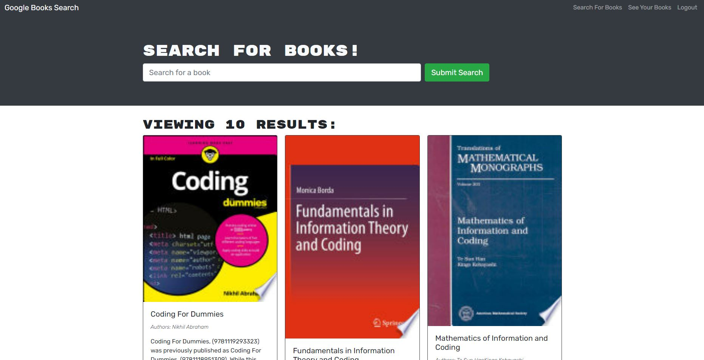

# 21-MERN-book-search-app

The assignment is about refactoring a fully functioning Google Books API search engine built with a RESTful API, and refactor it to be a GraphQL API built with Apollo Server. The app was built using the MERN stack with a React front end, MongoDB database, and Node.js/Express.js server and API. It was already set up to allow users to save book searches to the back end.

# Technologies used for refactoring

- npm Apollo-Server-Express package
- npm Apollo-Client package
- npm GraphQL package

# The refactoring included

1. Seting up an Apollo Server to use GraphQL queries and mutations to fetch and modify data, replacing the existing RESTful API.

2. Modifying the existing authentication middleware so that it works in the context of a GraphQL API.

3. Creating an Apollo Provider so that requests can communicate with an Apollo Server.

4. Deploying the application to Heroku with a MongoDB database using MongoDB Atlas.

# Screenshots

Displayed search results

Book saved to logged in profile

# Links

- [Github Repository](https://github.com/HenniePenny/21-MERN-book-search-app)
- [Deployed Application](https://serene-brushlands-11314.herokuapp.com/)
